# BookWeb
## Description
BookWeb is an online platform for book lovers to discover new books, connect with other readers and share their reading experiences. Thanks to it, you can keep a list of your favorite books in one place. The user will never forget the titles of the books he has read or wants to read. He can also search for new titles that interest him.
 
## Used technologies
The BookWeb web application is primarily written in C# using the ASP.NET framework to ensure its stability and performance. A powerful tool, Microsoft SQL Server, was used to store data. In order to provide an attractive and intuitive user interface, the front-end part of the application was created in CSHTML, and additionally CSS and JavaScript were used, as well as the Bootstrap library. To effectively connect to the database and generate entities, a package manager provided by Microsoft - EntityFrameworkCore - has been included in the project. Thanks to it, it was possible to efficiently manage database operations. The BookWeb application also has a user authentication system, which was implemented using the Microsoft.AspNetCore.Identity.EntityFrameworkCore and Microsoft.AspNetCore.Identity.UI packages. Thanks to them, you can provide a safe and personalized experience for users. To provide users with information and notifications, it was decided to use the toastr package, which allows displaying elegant and interactive notifications. The entire project was written using the extensive and developer-friendly Visual Studio environment, which provides full functionality and tools supporting the application development process.
 
## Diagrams
### UML diagram
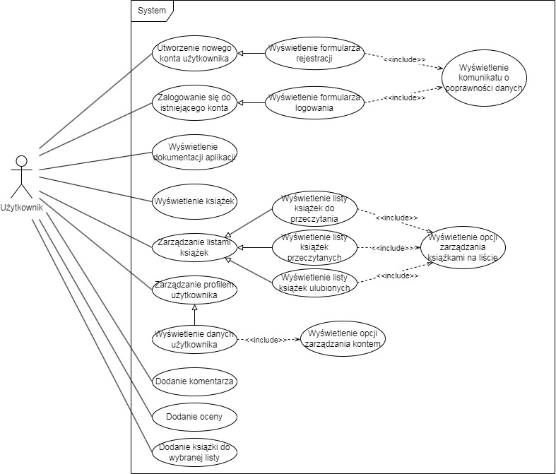
 
### Class diagram
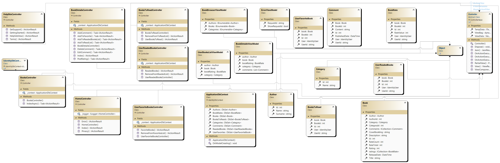
 
### Database diagram
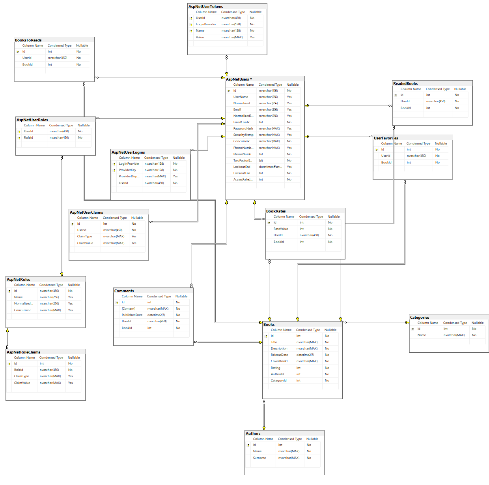
 
## Application appearance
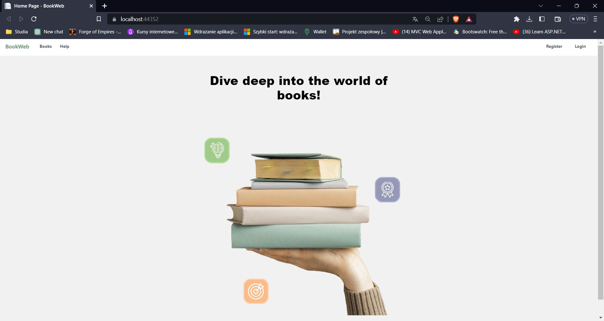
 
Application home screen. Here on the navigation bar we can select options such as login, registration and one of the two available Books and Help tabs.
 
 
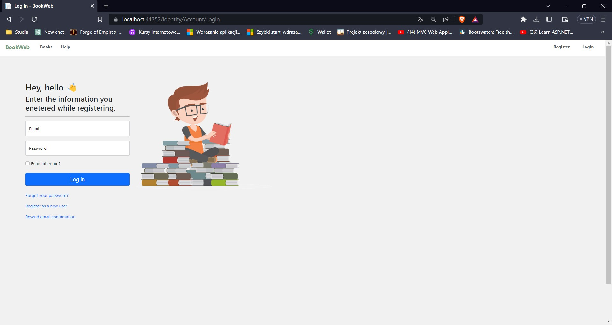
 
Login screen. It allows you to enter data such as email and password. If incorrect data is entered, error notifications will be displayed. Likewise for successful login.
 
 
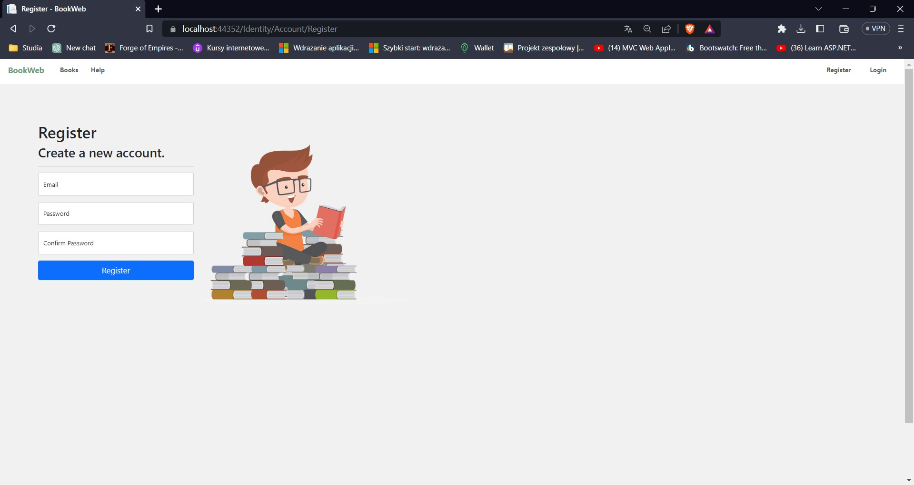
 
Registration screen. Allows you to enter your email and password. There is also a password repetition field to avoid mistakes when entering the password.
 
 
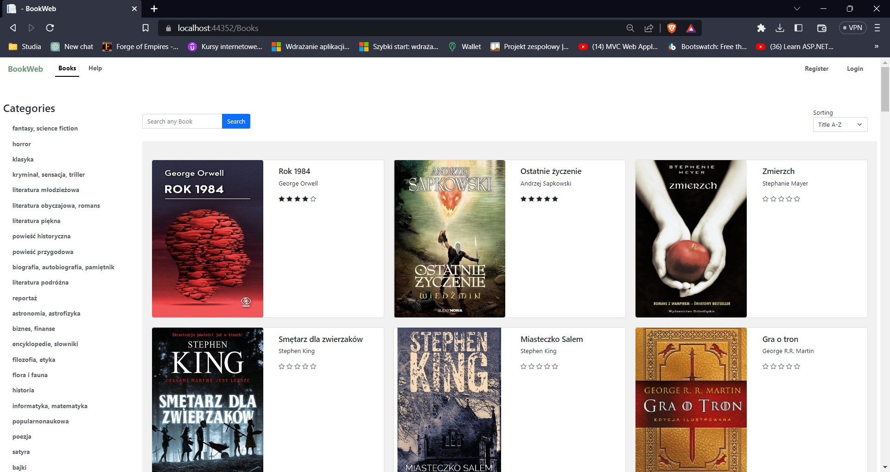
 
This is a view of the Books tab, where all available books in the database are listed. Here you can filter books by a specific category and sort by selected criteria. There is also a search engine here, thanks to which you can find the title you are interested in.
 
 
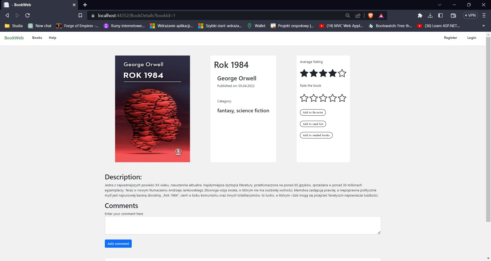
 
Detailed view of the book. This place contains data such as the book cover, description and rating. If the user is logged in, he or she can add a book rating and a review.
 
 
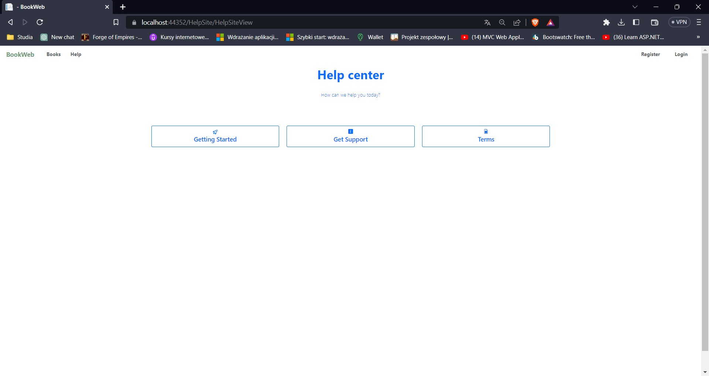
 
View of the Help tab, where you can select one of the 3 available help options. The first is a tab with a description of available functions, the second is contact details that can be used if you encounter an error or want to contact the website administrator. The last tab is the website regulations.
 
 
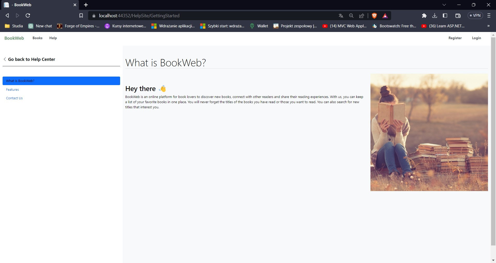
 
View of the help page after selecting the "Getting Started" option in the Help Tab. Here, on the left, there is a navigation bar that allows you to select one of 3 options. These are "What is BookWeb?", "Features" and "Contact Us". By default, when you launch the website, information about what the BookWeb web application is will be displayed.
 
 
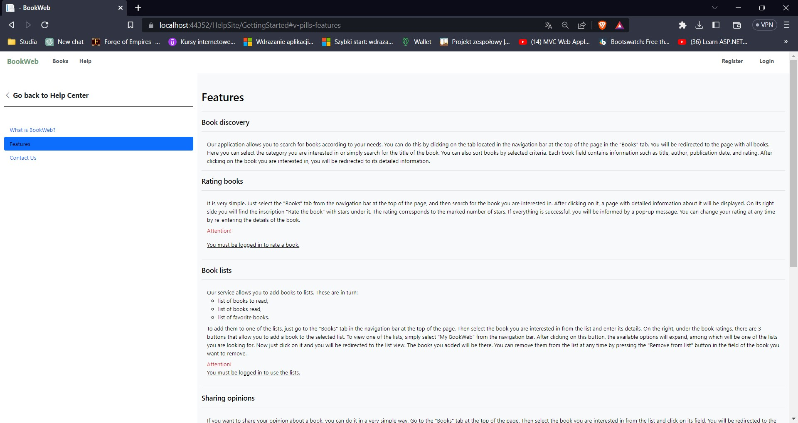
 
Widok strony „Features”. W tym miejscu znajdują się opisane wszystkie funkcjonalności serwisu oraz sposób z ich korzystania. 
 
 
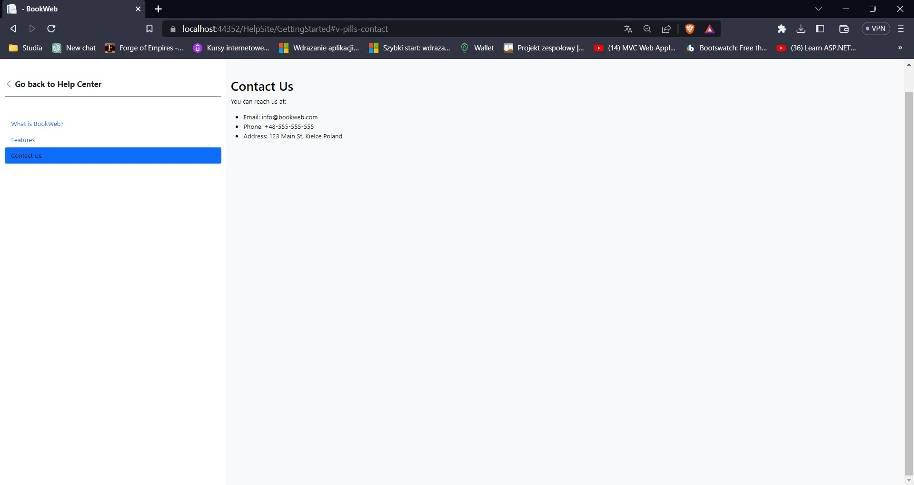
 
View of the "Contact Us" page. This place contains information such as email, telephone number and address in case the user encounters a problem and wants to contact the website administrator.
 
 
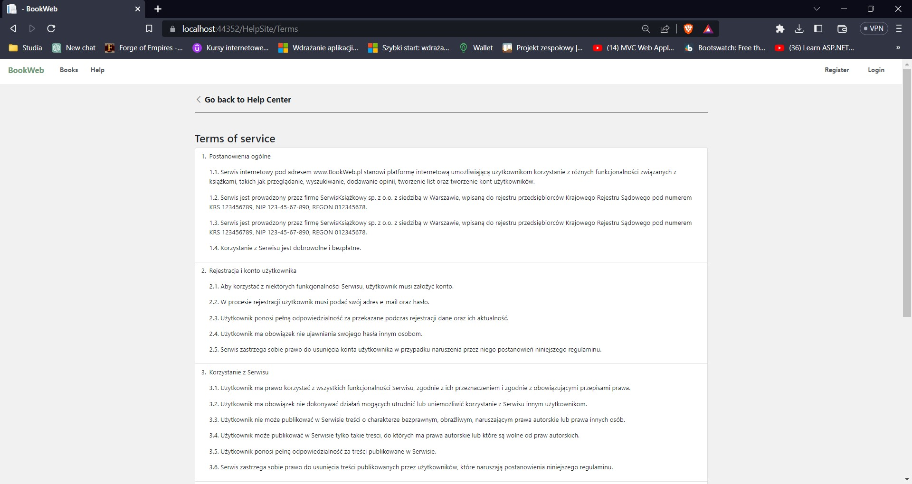
 
View of the help page after selecting the "Terms" option in the Help tab. The website regulations can be found here.
 
 

 
Home page view for the logged in user. After logging in, the navigation bar at the top of the page also displays, in addition to the previously mentioned, the "My BookWeb" drop-down list, which contains the user's lists and the user's profile in the form of the word "Hello" followed by the user's email name. For a logged-in user, the login and registration option disappears and instead has the "Logout" option to log out.
 
 
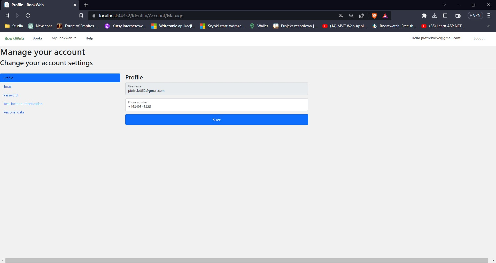
 
User profile details view. Here the user can manage their profile. In the profiles tab you can add your phone number and save the changes.
 
 
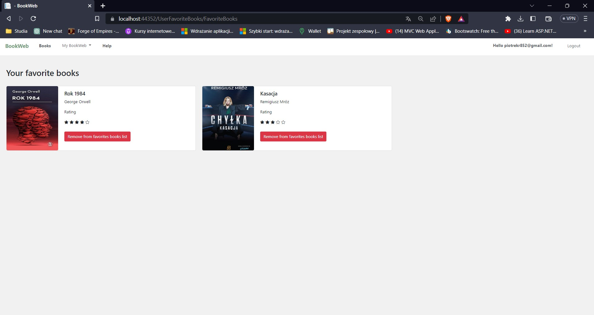
 
View of the user's favorite books list. Here you can remove the book from your favorites. If the user wants to see the details of a given book, he or she can click on it and the appropriate view will be displayed.
 
 
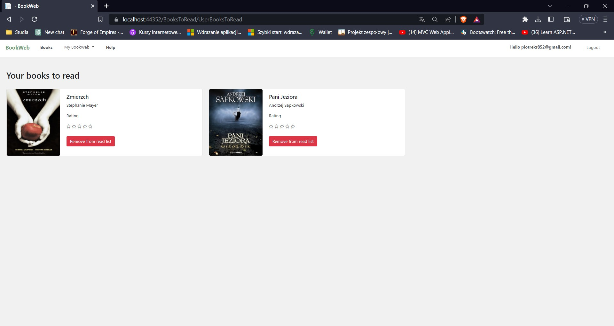
 
View of the list of books to read. It is possible to remove books from there.
 
 
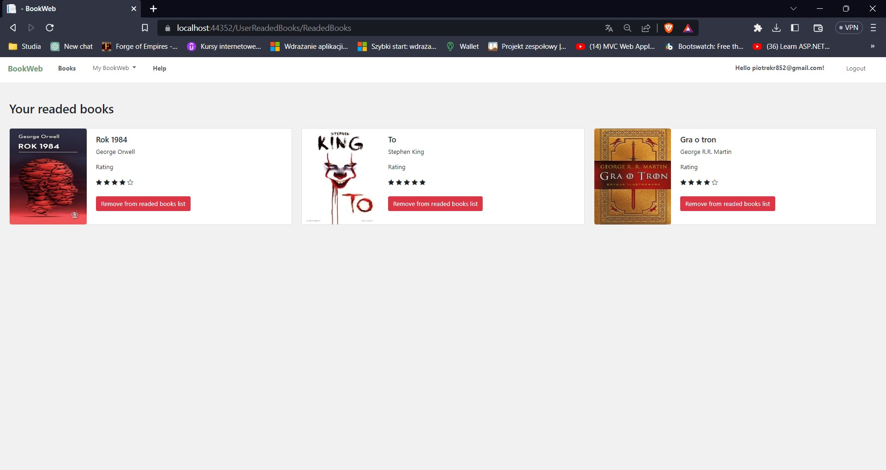
 
View of the list of books read. As in other lists, it is possible to remove selected books from the list.
 
